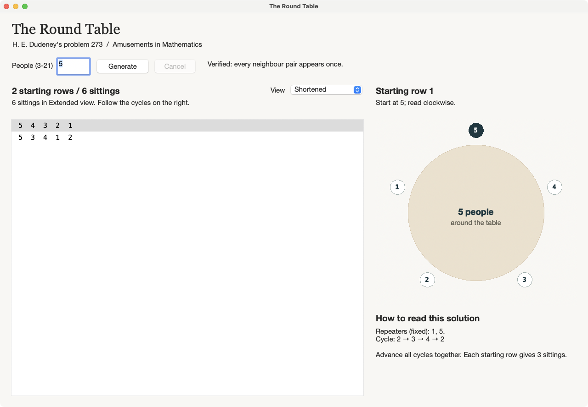

# The Round Table

Explore Henry Ernest Dudeney's round-table puzzle: seat a group over several sittings so that each person sits between every possible pair of neighbours exactly once.

Choose **3 to 21 people**, generate a solution, and select a row to see how everyone sits around the table. The app runs offline on macOS.



## Open the app

If you already have a built copy, double-click **The Round Table.app**. In this project, it is created in the `build` folder.

If you downloaded or cloned the source from GitHub, follow [Build from source](#build-from-source) first. The generated app is not included in the repository.

## Try your first solution

1. Open the app. It starts with a solution for five people.
2. Enter a whole number from **3 to 21** in **People**, then click **Generate** or press **Enter**.
3. Use **View** to choose **Shortened** or **Extended**.
4. Click a numerical row to see its seating diagram.

Read a row from left to right, or the diagram clockwise from the highlighted person at the top. The row wraps around: the last person sits beside the first. The highlight marks where to start reading; it does not identify a repeater.

The **Verified** message means the app has checked the complete schedule for the required neighbour pairs before showing it.

## Choose a view

| View | What you see | Use it to |
| --- | --- | --- |
| **Shortened** | Starting rows, repeaters and cycling instructions | Read a compact solution in Dudeney's style |
| **Extended** | Every individual sitting, separated into groups | Inspect each seating arrangement directly |

The app opens in Shortened and remembers your choice when you generate another solution during that session. Switching from Extended to Shortened selects the starting row for the current sitting's group. Switching back selects that group's first sitting.

For five people, the two starting rows expand into six sittings. For twenty-one, ten starting rows expand into 190 sittings. Three people need only one sitting, so both views show the same row.

### Read the shortened instructions

A **repeater** is a label that stays unchanged. A **cycle** tells you how to replace the other labels to produce the next sitting.

For example, the five-person solution keeps labels **1** and **5** fixed and uses this cycle:

```text
2 → 3 → 4 → 2
```

Replace every 2 with 3, every 3 with 4, and every 4 with 2, all at the same time. One starting row produces these three sittings:

```text
5 4 3 2 1    starting row
5 2 4 3 1    advance the cycle once
5 3 2 4 1    advance it again
```

The next advance returns to the starting row. Apply the same process to each starting row. If the instructions list several cycles, advance all of them together.

The app uses Dudeney's presentation method. Its generated rows and cycles can differ from his printed examples, and the shortened view does not always use the fewest possible starting rows.

## Controls and display

- **Enter** generates a solution; **Cancel** or **Escape** stops a pending generation.
- Editing the number clears the old answer. Press Generate to calculate the replacement.
- Use the arrow keys while the seating list is focused to move between rows. Group separators are skipped.
- Enlarge the window for more space. In a narrower window, scroll the seating list horizontally to reach the remaining labels and vertically to see more sittings.

If you see “Enter a whole number from 3 to 21,” replace the input with a number in that range. Supporting larger groups requires further verified constructions.

## Build from source

The current application uses macOS native controls. It has been built and tested with **PureBasic 6.41 Free, C backend, on an Apple Silicon Mac**.

Install PureBasic at `/Applications/PureBasic.app`, then open Terminal in the project folder and run:

```sh
scripts/build.sh app
open "build/The Round Table.app"
```

If PureBasic is installed elsewhere, supply its Resources directory:

```sh
PUREBASIC_HOME="/path/to/PureBasic.app/Contents/Resources" scripts/build.sh app
```

You can also open `src/main.pb` in the PureBasic IDE and compile it as a graphical application. Once built, the app runs without Python or the PureBasic IDE.

## About the puzzle

This is problem **273, “The Round Table,”** in Dudeney's *Amusements in Mathematics* (1917). A complete solution requires `(n - 1)(n - 2) / 2` sittings. Left and right neighbours count as the same pair when their order is reversed.

Read the [original problem and published solution](docs/references/problem-273-the-round-table.md), or browse the [complete public-domain book](docs/references/amusements-in-mathematics.txt). The [feasibility report](docs/references/solver-feasibility.md) explains the constructions and their sources.

## For contributors

Run the calculation tests with:

```sh
scripts/build.sh test
```

To exercise the native interface and capture screenshots:

```sh
scripts/build.sh gui-test
```

GUI checks require a logged-in macOS desktop and permission to capture windows. Logs and screenshots are written to `artifacts/`.

Start with `src/main.pb` for the application entry point, `src/app.pbi` for the interface, and `src/solver.pbi` for generation. The independent schedule checker is in `src/verify.pbi`.
